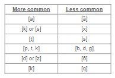

class: middle, center

# Review

---

# Review 

**Phoneme:** a set of sounds that speakers of a language treat as being the same

- written in **/slashes/**

--

**Allophone:** each individual possible sound that a phoneme could surface as

--

```{r, out.height="50%", out.width="50%", echo=FALSE}
knitr::include_graphics("./images/batman.png")
```


---

# Review

**Contrastive distribution:** when switching out one *phoneme* for another results in a different meaning

--

- these word pairs are called *minimal pairs*

- they detect which sounds are **phonemes**

- *that vs. mat*


---

class: middle, center

# Practice: minimal pairs

---

# Practice: minimal pairs 

*Are the following pairs of words minimal pairs? If they are, what phonemic contrast do they illustrate? Focus on the SOUNDS, not the spelling!*

1. wait - straight

2. taught - toot

3. fine - line

4. frog - log

5. skink - tin

6. boot - lute

7. ferris - fair

8. might - fright

---

# Practice: minimal pairs 

*Find a minimal pair to illustrate the following contrasts (the phonemes do not need to be at the beginning of the word!)*


1. /f/ - /v/ 

2. /b/ - /p/

3. /s/ - /z/

4. /θ/ – /ð/

5. /n/ - /m/

6. /a/ - /u/

7. /d/ - /t/ 

8. /i/ - /ʌ/

9. /t/ - /ð/ 

10. /t/ - /θ/

---

class: center, middle

# Review


---


# Review


**Complementary distribution:** when switching a sound out for another sound *does not* change the meaning

--

- allophones of the same phoneme

- *example. [t] versus [tʰ] in English*

--

- different environments cause the sound to change, but in the minds of speakers its still considered one sound

--

**Phonotactics:** rules for how we combine sounds to form words

- English doesn't allow the velar nasal at the beginning of a word, but Cook Islands Māori does


---

# Review

Different languages contrast different sounds, **but,** there are some common trends.

--

```{r, out.height="50%", out.width="50%", echo=FALSE}

```

--

If a language has the sounds on the right of each row, then it will also have the corresponding sound on the left.

---

# Review


**How to determine whether a sound is a phoneme or allophone:**

.pull-left[
1. for each word, write the preceding and following segment for the sound you're testing 

2. write down each different environment (again, looking at both the preceding and following sounds)

4. see if there are any common environments that both potential phonemes share
]


.pull-right[
```{r, out.height="100%", out.width="100%", echo=FALSE}
knitr::include_graphics("./images/phonetic_environments.png")
```
]

---

# Review

We use **minimal pairs** (contrastive distribution) to find evidence that two sounds are *phonemes*.

--

**Notes:**

- \# means word boundary (beginning or end of the word) is on that side

- _ represents the sound you're testing. it's like a placeholder

.pull-center[
```{r, out.height="50%", out.width="50%", echo=FALSE}
knitr::include_graphics("./images/phonetic_environments.png")
```
]

---


class: center, middle

# Practice: Sindhi data

---

# Practice: Sindhi data

*Examine the distribution of the sounds [p], [pʰ], [b] in these words from Sindhi, an Indo-European language spoken in Pakistan and India. Do you notice any minimal pairs?* 

*If so, what does that mean for these sounds - are they in contrastive or complementary distribution? Are they separate phonemes or are they allophones of the same phoneme?*

**Data on the next slide...**

---

# Review: Sindhi phonemes

.pull-left[
1. [pənu] "leaf"

2. [vədʒu] "opportunity"

3. [ʃeki] "suspicious"

4. [gədo] "dull"

5. [dəru] "door"

6. [pʰənu] "hood of a snake"
]

.pull-right[
7. [təru] "bottom"

8. [kʰəto] "sour"

9. [bədʒu] "run"

10. [bənu] "forest"

11. [bətʃu] "be safe"

12. [dʒədʒu] "judge"
]

---

class: center, middle

# Practice: Quechua

---

# Practice: Quechua

*Examine the sounds [u] and [o] in this data from Quechua. Write down all environments in which each sound occurs. Do you notice any patterns? Does the pattern suggest that the sounds are in contrastive or complementary distribution? Are they separate phonemes or allophones of the same phoneme?*

- [q] = voiceless uvular plosive

- [ʎ] = voiced palatal lateral

**Data on next slide...**

---

# Practice: Quechua

.pull-left[
1. [kusa] "nice"

2. [qomer] "green"

3. [tiŋku] "meeting"

4. [puka] "red"

5. [qosa] "husband"

6. [puŋku] "door"

7. [aʎqo] "dog"

8. [suwa] "thief"

9. [qosqo] "Cusco (city)"

10. [qotʃa] "lake"
]

.pull-right[
```{r, out.height="100%", out.width="100%", echo=FALSE}
knitr::include_graphics("./images/phonetic_environments.png")
```

]

---

# Practice: Cook Islands Māori

*Examine the* ***vowel sounds*** *in this data from Cook Islands Māori. Do you notice any patterns?*

- Does the pattern suggest some vowels are in contrastive or complementary distribution? 

- Are they separate phonemes or allophones of the same phoneme? 

- What can we generalize about the vowels here?

**Data on next slide...**

---

# Practice: Cook Islands Māori

.pull-left[

1. pūpū "a small shell"

2. tōna "his/hers"

3. kēkē "armpit"

4. kakā "glory; shine"

5. totō "to pull"

6. pupu "a group"

7. kaka "part of coconut tree"

8. titi "traditional dance skirt"

9. pūpū "a small shell"
]

.pull-right[

9. kēke "cake"

10. toto "blood"

11. pati "to ask"

12. tītī "a kind of bird"

1. kākā "a vine"

2. kekē "different"

3. tona "yaws"

4. pupū "to bubble up"

10. patī "to splash"

8. keke "to saw"

]

---

# Coming up: Phonology II !

### Reading 

- read the **phonology chapter** from the Grady textbook, if you haven't already.


### Scheduling

- Thanksgiving week (the week of Nov 23), **recitation will be asynchronous work**

